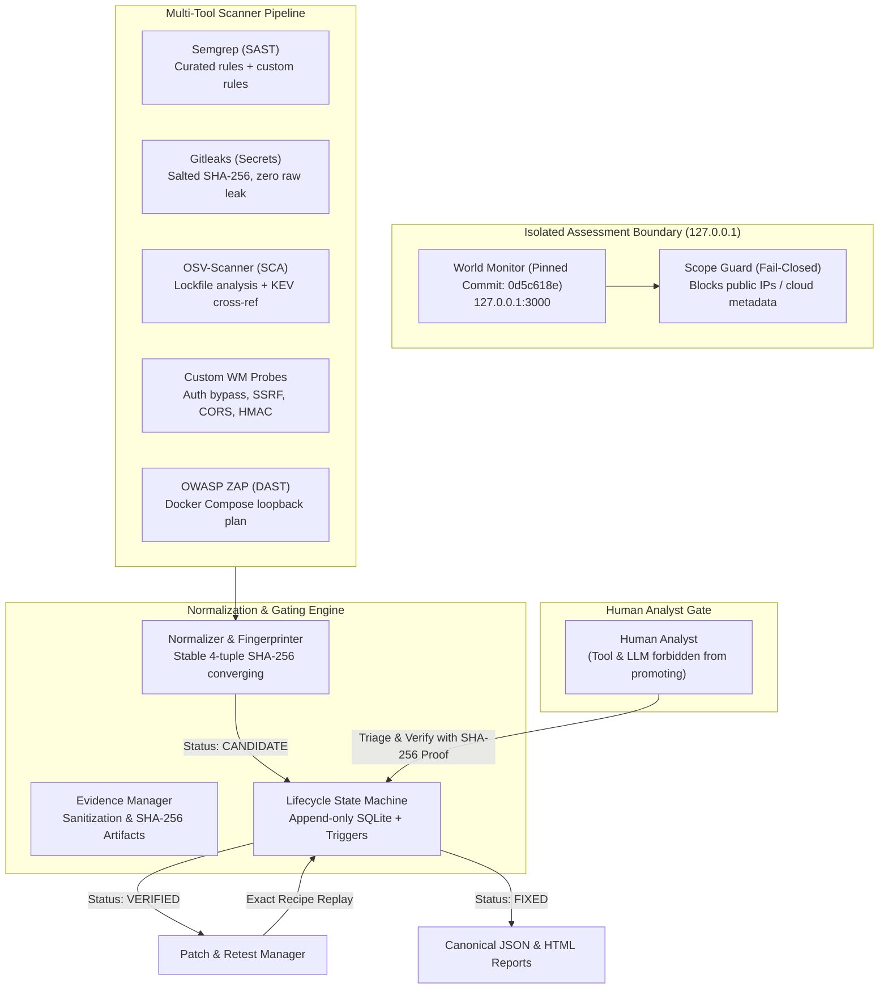

# World Monitor Security Assessment (WMSA)
> **SIH 2026 Problem Statement ID**: 26163  
> **Problem Statement Title**: Security Assessment of the World Monitor application  
> **Target Repository**: [koala73/worldmonitor](https://github.com/koala73/worldmonitor)  
> **Pinned Target Commit**: `0d5c618e4307414546a9be84a482ac06b7d56749`  
> **Execution Environment**: `local-isolated` (Strict loopback `127.0.0.1` isolation)  
> **Theme**: Smart Automation & Cybersecurity  

An end-to-end, local-first, evidence-gated security assessment platform built specifically for the World Monitor application. Enforces strict scope boundaries, cryptographic evidence gating, append-only SQLite audit trails, exact retest verification, and zero raw-secret leakage.

---

## 🏛️ Architecture & Core Principles



### 1. Loopback-Only Scope Guard (Fail-Closed)
- **Target Restriction**: All active security probes target strictly local loopback addresses (`127.0.0.1`, `localhost`).
- **Forbidden Targets**: Under no circumstances does WMSA transmit traffic to `worldmonitor.app` or public IPs.
- **Fail-Closed Gate**: DNS resolution checks, userinfo stripping, port restrictions (`3000`, `8080`, `46123`), and a hard kill switch (`wmsa kill` or `KILL` file sentinel) immediately terminate all activity.

### 2. Evidence Gate & Human Decision Enforcement
- **Automated Scanners produce `CANDIDATE` only**: No tool, script, or AI model can advance a finding to `TRIAGED`, `VERIFIED`, or `FIXED`.
- **Cryptographic Evidence Proof**: Transitioning to `VERIFIED` requires:
  1. Human analyst actor (`actor_type: analyst`).
  2. Documented business and security impact analysis.
  3. Pinned commit SHA and build ID.
  4. Cryptographic SHA-256 hashed evidence artifact recorded in SQLite.
- **Fixed Gate**: Transitioning to `FIXED` requires proposing a patch, applying to an isolated branch (`assess/<finding-id>`), and replaying the **exact recipe** with outcome `FIXED` matching before/after proof.

### 3. Salted Fingerprints & Zero Secret Leakage
- **Salted Hashes**: Hardcoded tokens, API keys, or leaked credentials are never stored in raw form.
- **Deep Redaction**: Both scanner outputs and LLM prompts pass through `redact()` replacing tokens with `[REDACTED_SECRET]` and computing salted SHA-256 hashes (`hmac-sha256(salt, secret)`).

### 4. Append-Only Audit Trail
- SQLite database (`wmsa.db`) with custom triggers preventing `DELETE` or `UPDATE` on `state_transitions` and `audit_events`.
- Full-Text Search (FTS5) indexed catalog for threat advisories and vulnerabilities.

---

## 🛠️ Tool Suite & Versions

All tool binaries and versions are pinned in [`tools.lock.json`](file:///Users/dewashishhatekar/Developer/Projects/Secure-Lens-SIH/tools.lock.json):

| Category | Tool | Pinned Version | Execution Mode | Scope / Safety |
|---|---|---|---|---|
| **SAST** | Semgrep | `1.176.0` | Local CLI | `--metrics=off`, curated registries + custom rules |
| **Secrets** | Gitleaks | `8.30.1` | Local CLI | `--redact`, salted fingerprinting, zero leakage |
| **SCA** | OSV-Scanner | `2.6.0` | Local CLI | `--no-ignore -r target`, parses 8 lockfiles |
| **DAST** | OWASP ZAP | `stable` | Docker Compose | Isolated bridge network, strict loopback host filter |
| **Probes** | Custom Runners | `1.0.0` | Python | Precondition checks, rate limits, safe payloads |
| **Intel** | CISA KEV / GHSA | Live / Cached | Local SQLite FTS5 | Exact CVE matching only, offline cache fallback |

---

## 🚀 Clean-Machine Reproduction Guide

### Step 1: Clone & Setup Virtual Environment
```bash
git clone https://github.com/nikhil-kumarrr/Secure-Lens-SIH.git
cd Secure-Lens-SIH

# Create and activate Python virtual environment (Python 3.11+)
python3 -m venv .venv
source .venv/bin/activate

# Install WMSA in editable mode
pip install -e .
```

### Step 2: Run Full Test & Calibration Suite
```bash
make check
```
*Executes all 56+ tests: scope guard matrix, adapter parsers, evidence gates, append-only triggers, retest workflow, threat intel FTS5 search, prompt injection defense, and calibration precision/recall.*

### Step 3: Initialize Database & Validate Scope
```bash
wmsa init
wmsa scope validate
```

### Step 4: Verify or Launch Target Build
```bash
# Verify pinned target commit (0d5c618e4307414546a9be84a482ac06b7d56749)
wmsa target verify

# Check target application health on 127.0.0.1:3000
wmsa target health
```

### Step 5: Execute Orchestrated Assessment Scan
```bash
# Run multi-tool scan (SAST + Secrets + SCA + Custom Probes)
wmsa scan --profile lite

# List detected candidate findings
wmsa findings list
```

### Step 6: Human Analyst Triage & Evidence Gate
```bash
# View finding details, affected lines, and fingerprint
wmsa findings show <finding-id>

# Triage finding
wmsa triage <finding-id> --reason "Confirmed unvalidated loopback proxying in api/rss-proxy.js"

# Verify finding (requires attached evidence and documented impact)
wmsa verify <finding-id> --reason "Reproduced SSRF in local environment" --impact "Internal service probing and unauthorized loopback access"
```

### Step 7: Patch & Exact Retest
```bash
# Propose a minimal remediation diff
wmsa patch propose <finding-id> --file patch.diff

# Apply patch in isolated assess/<finding-id> branch
wmsa patch apply <finding-id>

# Retest using identical recipe to verify remediation
wmsa retest <finding-id> --recipe wm-probe-ssrf-01
```

### Step 8: Export Reports
```bash
# Export canonical JSON and styled HTML reports
make report
# Or via CLI:
wmsa report export --format html --out reports/worldmonitor_security_report.html
wmsa report export --format json --out reports/worldmonitor_security_report.json
```

### Step 9: Launch Local Assessment Dashboard
```bash
make server
# Binds strictly to http://127.0.0.1:8000
```

---

## 📋 Complete CLI Reference

```text
wmsa init                              # Initialize database schema and verify environment
wmsa kill                              # Emergency kill switch: stops active probes
wmsa scan [--profile lite|full]        # Trigger orchestrated multi-scanner pipeline
wmsa findings list                     # List findings with optional --status/--severity filters
wmsa findings show <id>                # Inspect finding detail, timeline, and evidence
wmsa triage <id> --reason <text>       # Promote CANDIDATE -> TRIAGED (analyst only)
wmsa verify <id> --reason <text>       # Promote TRIAGED -> VERIFIED (requires evidence)
wmsa reject <id> --reason <text>       # Reject finding (analyst only)
wmsa patch propose <id> --file <diff>  # Propose patch diff
wmsa patch apply <id>                  # Create isolated branch assess/<id> and apply patch
wmsa retest <id> --recipe <recipe-id>  # Replay identical recipe and establish before/after proof
wmsa report export [--format json|html]# Export canonical JSON / styled HTML report
wmsa intel sync [--force]              # Synchronize CISA KEV and GHSA feeds into SQLite FTS5
wmsa intel search <query>              # FTS5 keyword and CVE search
wmsa intel status                      # View feed freshness and sync status
wmsa server [--port 8000]              # Launch local dashboard API bound to 127.0.0.1
```

---

## 🎯 Calibration & Precision / Recall

A dedicated, isolated calibration fixture is maintained in `tests/fixtures/calibration/` with known planted vulnerabilities and clean controls:
- **Planted Issues (True Positives)**:
  - `CALIB-SAST-01`: DOM XSS in `src/app.js` (`innerHTML` assignment).
  - `CALIB-SECRET-01`: Planted fake GitHub PAT token in `config/secrets.env`.
  - `CALIB-SCA-01`: Pinned vulnerable `lodash@4.17.15` (CVE-2021-23337) in `package-lock.json`.
  - `CALIB-PROBE-01`: Unauthenticated RSS proxy SSRF simulation.
- **Controls (True Negatives)**:
  - `CALIB-CLEAN-01`: Safe `textContent` DOM manipulation.
  - `CALIB-CLEAN-02`: Parameterized environment variable placeholder.
- **Results**:
  - Precision: **4/4 (100.0%)**
  - Recall: **4/4 (100.0%)**
  - Live target findings are kept strictly isolated and never conflated with calibration metrics.

---

## ⚠️ Mandatory Limitations & Integrity Note

1. **Cryptographic SHA-256 Hashing**: Evidence artifacts and reports are hashed using SHA-256. These hashes detect byte alteration and post-execution tampering; they are cryptographic integrity proofs, not third-party digital identity signatures.
2. **Candidate Hypotheses**: All automated scanner outputs are classified as `CANDIDATE` hypotheses until vetted and verified by a qualified human analyst through the evidence gate.
3. **Loopback Scope**: All testing was performed strictly against an isolated local checkout (`127.0.0.1:3000`). Public hosts and `worldmonitor.app` were never targeted.

---

## 🛡️ Responsible Disclosure Policy

Per the World Monitor security policy ([`SECURITY.md`](https://github.com/koala73/worldmonitor/blob/main/SECURITY.md)):
- Genuine vulnerabilities must be reported privately via **[GitHub Private Vulnerability Reporting](https://github.com/koala73/worldmonitor/security/advisories/new)** or by contacting the repository maintainers.
- Never file public GitHub issues for unpatched vulnerabilities.
- Provide step-by-step reproduction instructions and safe PoCs to allow maintainers sufficient time to publish patches.

---

## 📄 License
MIT License
