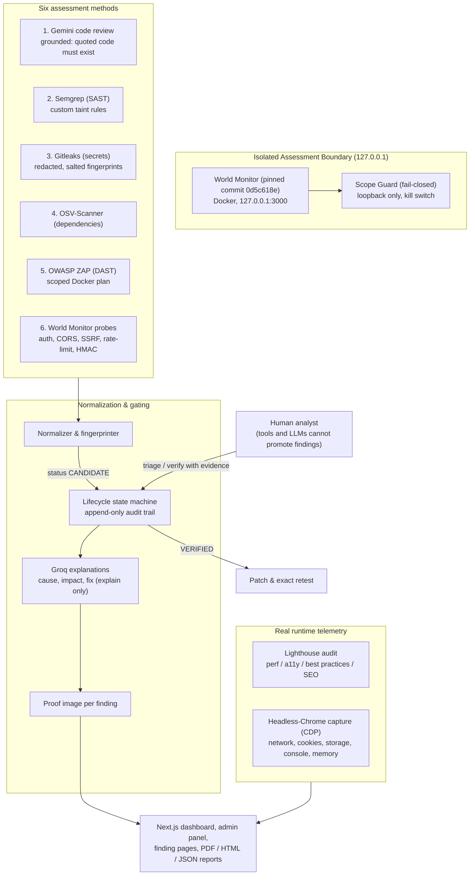

# World Monitor Security Assessment (WMSA) — SecureLens
> **SIH 2026 Problem Statement ID**: 26163  
> **Problem Statement Title**: Security Assessment of the World Monitor application  
> **Target Repository**: [koala73/worldmonitor](https://github.com/koala73/worldmonitor)  
> **Pinned Target Commit**: `0d5c618e4307414546a9be84a482ac06b7d56749`  
> **Execution Environment**: `local-isolated` (strict loopback `127.0.0.1` isolation)  
> **Theme**: Smart Automation & Cybersecurity  

An end-to-end, local-first, evidence-gated security assessment platform built for the World Monitor application. It runs six assessment methods against a pinned, isolated build, turns their output into evidence-gated findings, explains each one with an LLM, renders a proof image per finding, and presents everything in a Next.js dashboard and admin panel.

**Guiding rule:** deterministic tools detect, the AI only explains, and nothing is shown as verified without evidence. Every scanner result is a `CANDIDATE` until a human analyst verifies it.

> For the detailed, verified status of every component (and what is *not* done), see [`what_we_have_done.md`](what_we_have_done.md).

---

## 🏛️ Architecture & Core Principles



### 1. Loopback-only scope guard (fail-closed)
- All active probing targets loopback only (`127.0.0.1`, `localhost`); public IPs, cloud metadata addresses and off-list ports (`3000`, `8080`, `46123` allowed) are blocked, and a kill switch (`wmsa kill` / `KILL` sentinel) stops activity immediately.
- Every dashboard API endpoint that takes a `target_url` enforces the same guard and returns **403** for external hosts. `worldmonitor.app` and other public hosts are never scanned.

### 2. Evidence gate & human decision enforcement
- Scanners, scripts and LLMs produce `CANDIDATE` only; none can advance a finding to `TRIAGED`, `VERIFIED` or `FIXED` (attempts are audited).
- `VERIFIED` requires an analyst actor, a reason, a documented impact, a pinned commit/build and a hashed evidence artifact. `FIXED` requires a patch on an isolated branch and an exact-recipe retest with outcome `FIXED`.
- A retest whose recipe never exercises the target (the offline HMAC simulation) is `INCONCLUSIVE` and cannot mark a finding fixed.

### 3. Honest results: no simulated or placeholder data
- A missing scanner binary **fails loudly**; there are no fallback "pretend" scanners.
- The dashboard shows only measured or stored data. With no data you see zeros and "not measured" states, never invented scores. Trends appear only after 2+ real audits.
- Probe verdicts are fail-closed: blocked, unobservable or mismatching steps are never reported as "expectation met".

### 4. AI assistance with guardrails
- **Gemini** reviews the code structure; a finding is kept only if its file exists and the quoted code really appears in it (hallucinations are dropped).
- **Groq** normalizes each finding into one explanation and powers the copilot, which answers only from stored findings.
- Source and findings sent to a model are redacted and fenced as untrusted data. Gemini's setup plan is checked against an allowlist; only the vetted loopback compose file is ever executed.

### 5. Zero raw-secret leakage & append-only audit trail
- Tokens are redacted (`[REDACTED_SECRET]`) in scanner output, LLM prompts, raw-output views and browser-storage inspection; fingerprints are salted hashes.
- `state_transitions` and `audit_events` reject `UPDATE`/`DELETE` via database triggers.

---

## 🗂️ Project Directory Structure

```text
Secure-Lens-SIH/
├── frontend/                   # Next.js (App Router) + Tailwind + Redux Toolkit, served on :3100
│   ├── src/app/                # /admin and /findings/[id] pages
│   ├── src/views/              # Dashboard (/)
│   ├── src/components/         # cards, DevTools suite, scan modal, proof lightbox …
│   ├── src/store, lib, services/
│   └── next.config.mjs
│
├── backend/                    # Python WMSA engine + FastAPI
│   ├── config/                 # scope.yaml (loopback allowlist), profiles.yaml, tools.lock.json
│   ├── docker/                 # compose.target.yaml (isolated World Monitor), compose.zap.yaml
│   ├── probes/                 # probe recipes + manual review notes
│   ├── rules/                  # Semgrep rules, Gitleaks config, ZAP plan template
│   ├── src/wmsa/
│   │   ├── adapters/           # semgrep, gitleaks, osv, zap, probes, gemini_review
│   │   ├── pipeline.py         # one-click pipeline (setup → scans → audit → explain → proofs)
│   │   ├── orchestrator.py, enrich.py, proof.py, cdp.py, webaudit.py
│   │   ├── dashboard.py, copilot_chat.py, setup_assistant.py, devtools.py, api.py
│   │   └── scope.py, lifecycle.py, evidence.py, normalize.py, patching.py, retest.py, intel.py, report.py, db.py
│   ├── tests/                  # 79 tests + calibration fixture
│   ├── .env.example            # GEMINI_API_KEY / GROQ_API_KEY template (copy to .env, never commit)
│   └── target/                 # pinned World Monitor checkout (gitignored, created by `wmsa target setup`)
│
├── Makefile                    # install, check, scan, report, server, dashboard, target-up/down
├── what_we_have_done.md        # detailed verified status, limitations, change log
└── README.md
```

---

## 🛠️ Tool Suite & Versions

Scanner binaries and versions are pinned in [`backend/tools.lock.json`](backend/tools.lock.json):

| Category | Tool | Version | Mode | Notes |
|---|---|---|---|---|
| **Code review** | Gemini API | `gemini-3.8-flash` (+ fallbacks) | Cloud API | Redacted, grounded; key from `backend/.env` |
| **SAST** | Semgrep | `1.176.0` | Local CLI | `--metrics=off`, custom taint rules |
| **Secrets** | Gitleaks | `8.30.1` | Local CLI | `--redact`, default rules + allowlists |
| **SCA** | OSV-Scanner | `2.6.0` | Local CLI | lockfile analysis |
| **DAST** | OWASP ZAP | `stable` | Docker | free proxy port, loopback scope, ~5 min |
| **Probes** | Custom runners | `1.0.0` | Python | scope-guarded, request-capped, honest verdicts |
| **Web audit** | Lighthouse | `13.x` (via `npx`) | Headless Chrome | real Performance/Accessibility/Best Practices/SEO + Core Web Vitals |
| **Browser capture** | Chrome DevTools Protocol | Chrome/Chromium | Headless | real network, cookies, storage, console, memory |
| **Explanations** | Groq | `openai/gpt-oss-120b` | Cloud API | explains only; template fallback |
| **Intel** | CISA KEV / GHSA | live / cached | SQLite FTS5 | exact CVE matching |

---

## 🚀 Quick Start (clean machine)

**Prerequisites:** Python 3.11+, Node.js 20+, Docker, Chrome/Chromium, [`uv`](https://docs.astral.sh/uv/) (recommended), and the `gitleaks` (8.30.1) and `osv-scanner` (2.6.0) binaries on your `PATH` or in `~/.local/bin`.

```bash
git clone https://github.com/Dewashish-resiliencesoft/Secure-Lens-SIH.git
cd Secure-Lens-SIH

# 1. Backend environment (creates backend/.venv; installs Semgrep and psycopg extras)
make install

# 2. API keys for the AI features (optional; scanners work without them)
cp backend/.env.example backend/.env      # then edit: GEMINI_API_KEY, GROQ_API_KEY

# 3. Run the tests
make check                                # 79 tests

# 4. Clone the pinned target and start it isolated on 127.0.0.1:3000
backend/.venv/bin/python -m wmsa.cli target setup
make target-up                            # docker compose, loopback only

# 5. Start the API (127.0.0.1:8000) and the dashboard (127.0.0.1:3100)
make server            # terminal 1
make dashboard         # terminal 2
```

Open **http://127.0.0.1:3100/admin** and press **“Run all 6 scans”**. The pipeline runs Gemini review → Semgrep → Gitleaks → OSV → ZAP → probes → Lighthouse → Groq explanations → proof images (about 9 minutes, mostly the ZAP scan). Without API keys the Gemini review and Groq explanations report an error or use template text; the other methods still run.

### Where to look
| URL | What it shows |
|---|---|
| `/` | dashboard: measured Lighthouse scores, Core Web Vitals, activity, recommendations, posture/radar, findings, attack surface, copilot, reports (deep-link tabs with `?tab=inspect`, `vulns`, `ai-chat`, `reports`, `admin`) |
| `/admin` | pipeline runner with live status, findings with filters and proof thumbnails, per-tool runs (method, command, raw hash, redacted raw output), Gemini review notes, audit log |
| `/findings/<id>` | where it was found, how the tool found it, proof image (click to enlarge), highlighted code, cause, impact, exploitation walkthrough, fix, lifecycle |
| `http://127.0.0.1:8000/docs` | API reference |

---

## 🔬 CLI workflow (analyst gate, patch and retest)

```bash
wmsa init && wmsa scope validate          # database + scope manifest
wmsa target health                        # target reachable on 127.0.0.1:3000?
wmsa scan --profile lite                  # tools from config/profiles.yaml
wmsa findings list
wmsa findings show <finding-id>

# Analyst decisions (evidence gate)
wmsa triage <finding-id> --reason "Confirmed missing allowlist in rss-proxy sidecar"
wmsa verify <finding-id> --reason "Reproduced against local target" --impact "Open relay for arbitrary public URLs"

# Patch on an isolated branch, then replay the exact recipe
wmsa patch propose <finding-id> --diff-file patch.diff
wmsa patch apply <finding-id>
wmsa retest <finding-id> wm-probe-ssrf-01

# Reports
wmsa report export --format html --out backend/reports/worldmonitor_security_report.html
wmsa report export --format json --out backend/reports/worldmonitor_security_report.json
```
PDF export is available from the API/dashboard (`GET /api/report/export?format=pdf`, rendered with headless Chrome).

### CLI reference
```text
wmsa init                               Initialize directories, database and verify tools
wmsa kill                               Kill switch: abort scans and block outbound traffic
wmsa scan [--profile lite|standard]     Run the multi-scanner pipeline (standard adds ZAP)
wmsa findings list | show <id>          List / inspect findings and evidence
wmsa triage | verify | reject <id>      Analyst decisions (evidence-gated)
wmsa patch propose <id> --diff-file <f> | apply <id>   Patch diff and isolated branch assess/<id>
wmsa retest <id> <recipe-id>            Exact-recipe replay with before/after proof
wmsa target setup | up | down | health  Clone pinned commit, run isolated target, health gate
wmsa scope validate                     Validate the loopback scope manifest
wmsa probes …                           World Monitor probe operations
wmsa intel sync | search | status       CISA KEV / GHSA sync and FTS5 search
wmsa report export [--format json|html] Export the report
wmsa server [--port 8000]               Launch the API on 127.0.0.1
```

---

## 🎯 Calibration & Precision / Recall

A calibration fixture in `backend/tests/fixtures/calibration/` contains known planted issues and clean controls:
- **Planted:** DOM XSS (`innerHTML`), a fake GitHub PAT in `config/secrets.env`, vulnerable `lodash@4.17.15`, and an RSS-proxy SSRF simulation.
- **Controls:** safe `textContent` use and a parameterized placeholder.
- **Result:** 4/4 planted issues detected and 0 false positives on the controls (`test_calibration.py`). Live-target findings are kept separate from calibration metrics.

---

## 📊 Latest run on the pinned target (for reference)

85 candidate findings from 6/6 scanners: Semgrep 14, Gitleaks 14, OSV 42, ZAP 9, Gemini review 5, probes 1; 64 endpoints with recorded results; Lighthouse 73 / 96 / 96 / 92 (performance varies run to run); risk score 61 (High, candidate-weighted). Only one finding has been reproduced by hand — the `/api/rss-proxy` sidecar has no domain allowlist and relays arbitrary public URLs (private IPs and metadata addresses are blocked) — so treat the rest as candidates to triage.

---

## ⚠️ Mandatory Limitations & Integrity Note

1. **Candidates, not confirmed vulnerabilities.** All automated output is `CANDIDATE` until vetted by an analyst; Gemini/Groq output is explanatory and can over-state severity.
2. **Cryptographic SHA-256 hashing** detects alteration of evidence and reports; it is an integrity proof, not a digital identity signature.
3. **Loopback scope.** All testing targets the isolated local checkout. Public hosts, including `worldmonitor.app`, are never scanned.
4. **Not exercised in the latest verification:** the patch/retest flow on the real target, the PostgreSQL path (SQLite is the default), and prompt-injection resistance against a live model. **Not implemented:** NVD sync, target test accounts, a scheduler, and video proof (images only).
5. **Free-tier AI quotas** can cause fallbacks (model order for Gemini, template text for Groq).
6. **API keys** live only in `backend/.env` (gitignored). Rotate any key that has been shared.

---

## 🛡️ Responsible Disclosure Policy

Per the World Monitor security policy ([`SECURITY.md`](https://github.com/koala73/worldmonitor/blob/main/SECURITY.md)):
- Report genuine vulnerabilities privately via **[GitHub Private Vulnerability Reporting](https://github.com/koala73/worldmonitor/security/advisories/new)** or to the maintainers.
- Never file public issues for unpatched vulnerabilities.
- Provide step-by-step reproduction and safe PoCs so maintainers can publish patches.

---

## 📄 License
MIT License
