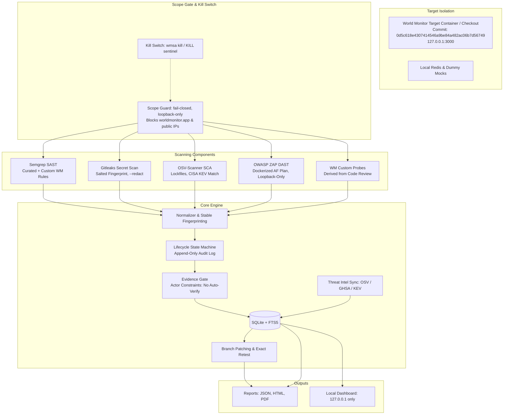

# Implementation Plan: World Monitor Security Assessment Workflow (SIH 2026, PS 26163)

A local-first, evidence-gated security assessment workflow for the open-source **World Monitor** application (`https://github.com/koala73/worldmonitor`).

---

## 1. Architecture Overview & Principles



### Non-Negotiable Enforcements
1. **Scope & Safety**: Outbound calls strictly routed through `scope.guard(url)`. Non-loopback/non-allowlist destinations rejected immediately. `worldmonitor.app` is permanently barred from active requests.
2. **Evidence Gate**: Scanners produce `CANDIDATE` only. Transition to `VERIFIED` strictly requires human analyst sign-off, pinned build context, and hashed evidence artifacts. No tool or LLM may promote to `VERIFIED` or `FIXED`.
3. **Reproducibility**: Patch on an isolated branch (`assess/<finding-id>`) followed by an exact recipe retest with identical parameters.
4. **Secret Hygiene**: Raw secrets are never stored, logged, or exported; only salted fingerprints, rule metadata, and locations are preserved.

---

## 2. Phase 0 Detailed Plan: Foundations & Scope Enforcement

### 2.1 Workspace Layout
We establish the clean structure required by the specification:
```
.
├── config/
│   ├── scope.yaml             # Active scope manifest (gitignored)
│   ├── scope.example.yaml     # Scope manifest template
│   └── profiles.yaml          # lite | standard profiles
├── docker/
│   ├── compose.target.yaml    # Isolated target compose with dummy env
│   └── compose.zap.yaml       # Isolated ZAP runner
├── rules/
│   ├── semgrep/worldmonitor/  # Custom Semgrep rules
│   ├── gitleaks/worldmonitor.toml # Custom allowlists
│   └── zap/plan.template.yaml # ZAP Automation Framework plan template
├── probes/
│   ├── REVIEW_NOTES.md        # Manual code-review notes
│   ├── recipes/               # Safe probe YAML specifications
│   └── runners/               # Probe runner execution modules
├── src/
│   └── wmsa/
│       ├── __init__.py
│       ├── cli.py             # Typer CLI entrypoint
│       ├── scope.py           # Scope guard, URL canonicalizer & kill switch
│       ├── target.py          # Target git checkout, commit pinning, health checks
│       ├── db.py              # SQLite schemas, migrations & query layer
│       ├── orchestrator.py    # Pipeline runner with timeouts and resource tracking
│       ├── normalize.py       # Canonical finding schema & dedup
│       ├── lifecycle.py       # State machine & evidence gate
│       ├── evidence.py        # Artifact redaction, hashing & storage
│       ├── patching.py        # Git branch/worktree patcher
│       ├── retest.py          # Exact recipe replay engine
│       ├── intel.py           # Threat intel sync (OSV, GHSA, KEV) + FTS5
│       ├── report.py          # JSON, HTML, PDF exporters
│       └── adapters/
│           ├── base.py
│           ├── semgrep.py
│           ├── gitleaks.py
│           ├── osv.py
│           ├── zap.py
│           └── probes.py
├── tests/
│   ├── fixtures/
│   ├── test_scope.py
│   ├── test_target.py
│   ├── test_db.py
│   └── ...
├── pyproject.toml
└── tools.lock.json
```

### 2.2 Scope Manifest & Scope Guard (`src/wmsa/scope.py`)
- Pydantic model for `ScopeManifest`:
  - `scope_id`: string identifier
  - `repo_url`: `https://github.com/koala73/worldmonitor`
  - `commit_sha`: pinned git commit hash (e.g. `0d5c618e4307414546a9be84a482ac06b7d56749`)
  - `local_path`: local checkout path
  - `allowed_hosts`: `["127.0.0.1", "localhost", "worldmonitor-target"]`
  - `allowed_ports`: `[3000, 8080, 46123]`
  - `allowed_route_prefixes`: `["/api/", "/", "/docs/"]`
  - `test_identities`: synthetic credentials only
  - `max_requests_per_probe`: integer limit (default 20)
  - `max_scan_minutes`: timeout limit
  - `approved_by` & `approved_at`: analyst audit fields
- `scope.guard(url: str)`:
  - Canonicalizes URL using `urllib.parse`.
  - Rejects non-HTTP/HTTPS schemes (e.g. `file://`, `gopher://`).
  - Resolves host via DNS / IP parsing to detect DNS rebinding and loopback evasion.
  - Strips userinfo (`user:pass@host`) to prevent URL authority spoofing.
  - Strictly rejects `worldmonitor.app`, cloud metadata IPs (`169.254.169.254`), link-local, and public IPs.
  - Checks against `allowed_hosts` and `allowed_ports`.
- `KillSwitch`:
  - Sentinel file check (`KILL` or `config/.kill`).
  - Active check in `scope.guard` and every runner loop.
  - `wmsa kill` command creates the sentinel and terminates active subprocesses.

### 2.3 SQLite Schema (`src/wmsa/db.py`)
Tables created using standard library `sqlite3` with foreign keys enabled:
- `scope_manifests`: id, manifest_yaml, commit_sha, approved_by, approved_at, created_at.
- `scans`: scan_id, profile, status, start_time, end_time, resource_metrics_json.
- `tool_runs`: run_id, scan_id, tool_name, tool_version, command_line, exit_code, raw_output_path, raw_output_sha256, peak_ram_mb, duration_seconds.
- `findings`: finding_id (UUID), stable_fingerprint, category, title, severity, cvss_score, status, commit_sha, build_id, created_at, updated_at.
- `finding_sources`: id, finding_id, tool_name, rule_id, raw_snippet_hash, raw_ref.
- `evidence`: evidence_id, finding_id, recipe_id, artifact_type, file_path, sha256_hash, metadata_json, created_at.
- `state_transitions` (Append-Only): id, finding_id, from_status, to_status, actor_type, actor_id, reason, timestamp.
- `patches`: patch_id, finding_id, branch_name, diff_content, commit_sha, created_by, created_at.
- `retests`: retest_id, finding_id, patch_id, recipe_id, outcome, original_evidence_hash, retest_evidence_hash, timestamp.
- `advisories` & `advisories_fts`: CVE/GHSA/OSV data with FTS5 virtual table for full-text search.
- `feed_syncs`: feed_name, last_sync_time, record_count, status.
- `audit_events` (Append-Only): id, event_type, actor_type, actor_id, payload_json, timestamp.

### 2.4 Target Setup & Health Gate (`src/wmsa/target.py`)
- `wmsa target setup`:
  - Clones `koala73/worldmonitor` into `target/` (gitignored).
  - Checks out the pinned `commit_sha`.
  - Validates repository commit against manifest.
  - Writes build record into SQLite DB.
- `wmsa target health`:
  - Polls loopback endpoint (`http://127.0.0.1:3000/api/health` or `/`) with scope guard validation.
  - Returns `HEALTHY` or `UNAVAILABLE`.
  - Required as a gate before any DAST or probe execution.

### 2.5 Phase 0 Verification & Acceptance Gate
- Unit tests:
  - `test_scope_guard_blocks_external_hosts`: Verifies `worldmonitor.app`, `8.8.8.8`, `169.254.169.254`, `http://127.0.0.1@evil.com` fail closed.
  - `test_scope_guard_permits_allowed_loopback`: Verifies `http://127.0.0.1:3000/api/` passes.
  - `test_kill_switch`: Verifies sentinel creation immediately halts execution.
  - `test_db_initialization_and_transitions`: Verifies table creation and append-only constraints.
  - `test_target_commit_pinning`: Verifies commit check enforces exact SHA match.

---

## 3. Roadmaps for Subsequent Phases (1 to 8)

- **Phase 1: Adapters for Semgrep, Gitleaks, OSV-Scanner**
  - Tool CLI verification with `--help`.
  - Pinned configurations in `tools.lock.json`.
  - Zero secret leakage guarantee with salted fingerprint tests.
- **Phase 2 & 2b: Manual Code Review, WM Probes, Custom Rules & ZAP**
  - Comprehensive review of `api/`, `server/`, `middleware.ts` in World Monitor.
  - Probe recipes asserting expected safe behaviors.
  - Scoped ZAP Automation Framework plan with health preflight.
- **Phase 3: Normalizer, Lifecycle State Machine & Evidence Gate**
  - Pydantic Finding model v1.0.
  - Enforce actor constraints: `tool` and `llm` cannot set `VERIFIED` or `FIXED`.
- **Phase 4: Branch Patching & Exact Retest**
  - Isolated branch `assess/<finding-id>`, identical recipe replay, before/after proof.
- **Phase 5: Reports & Dashboard**
  - Canonical JSON, HTML, PDF reports.
  - Connect with local frontend dashboard.
- **Phase 6: Threat Intelligence Sync**
  - OSV, GHSA, CISA KEV caching + SQLite FTS5 search.
- **Phase 7: Optional Local LLM Adapter**
  - Strict redaction and prompt-injection resistance.
- **Phase 8: Calibration Fixture & Clean-Machine Reproduction**
  - Separately labelled fixture demonstrating end-to-end precision/recall.

---

## 4. Assumptions & Notes
1. **Target Repository**: Target repository is `https://github.com/koala73/worldmonitor`. The default main branch commit is `0d5c618e4307414546a9be84a482ac06b7d56749`.
2. **Scanner Availability**: `gitleaks` (8.30.1) and `osv-scanner` (2.6.0) are installed locally. `semgrep` is being installed via Homebrew. OWASP ZAP runs via Docker container `zaproxy/zap-stable`.
3. **Target Execution**: Docker Compose will be provided for target execution with dummy environment variables (mocked external APIs) on loopback.
4. **Existing Frontend**: The existing React frontend in `frontend/` will be preserved and integrated in Phase 5 to serve as the local dashboard over the SQLite data.

---

## 5. Phase 9 Plan: Frontend-Backend Live Connection

### 5.1 Objectives
- Connect React UI (`frontend/`) to FastAPI REST backend (`backend/src/wmsa/api.py`, `http://127.0.0.1:8000/api`).
- Replace static mock vulnerability lists with live SQLite findings.
- Enable interactive scan triggers from UI (`POST /api/scan`).
- Enable analyst lifecycle actions from UI (`POST /api/triage/{id}`, `POST /api/verify/{id}`, `POST /api/reject/{id}`).
- Wire report download button directly to `GET /api/report/export?format=html` and `?format=json`.
- Keep graceful fallback to mock data if backend server is unreachable.

### 5.2 Implementation Tasks
1. `frontend/src/services/api.ts`: Typed fetch client for health, scope, findings, scan, triage, verify, reject, report export.
2. `frontend/src/components/FindingsTable.tsx`: Live fetch from `/api/findings` with status filter, severity filter, and search.
3. `frontend/src/components/ScanModal.tsx`: Real scan trigger via `POST /api/scan` (lite/full profiles) with live progress feedback.
4. `frontend/src/components/VulnModal.tsx`: Real analyst lifecycle buttons updating backend SQLite state machine.
5. `frontend/src/components/ReportSummary.tsx`: Real report download triggers.
6. End-to-end verification against live backend on `127.0.0.1:8000`.

---

## 6. Phase 10 Plan: Clean Slate & Dynamic Admin Panel

### 6.1 Objectives
- Remove all dummy findings and mock telemetry from `frontend/src/data.ts`.
- Provide a clean baseline state (0 vulnerabilities, 0 mock findings) on first load.
- Purge SQLite assessment database (`backend/wmsa.db`) to ensure clean start without sample findings.
- Implement an **Admin Panel** (`AdminPanel.tsx`) in the frontend allowing user to configure:
  1. Target Website URL (e.g. `http://127.0.0.1:3000` or custom loopback / web endpoint).
  2. Target GitHub Repository URL (e.g. `https://github.com/koala73/worldmonitor` or user-specified repo).
  3. Pinned Commit SHA / Branch (auto-detected or manually specified).
  4. One-click Target Cloning & Setup.
  5. One-click Security Audit Scan Execution.
  6. Database Clean Slate (Purge all findings).
- Implement backend endpoints:
  - `POST /api/target/configure`: Clones/updates target repo, updates scope manifest, checks out commit, optionally resets DB.
  - `POST /api/db/reset`: Cleanses SQLite findings, scans, evidence, tool_runs for clean slate.
- Live telemetry reflecting current target and live database findings count.

